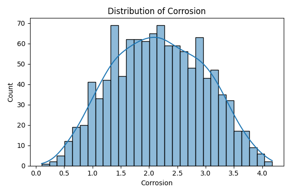
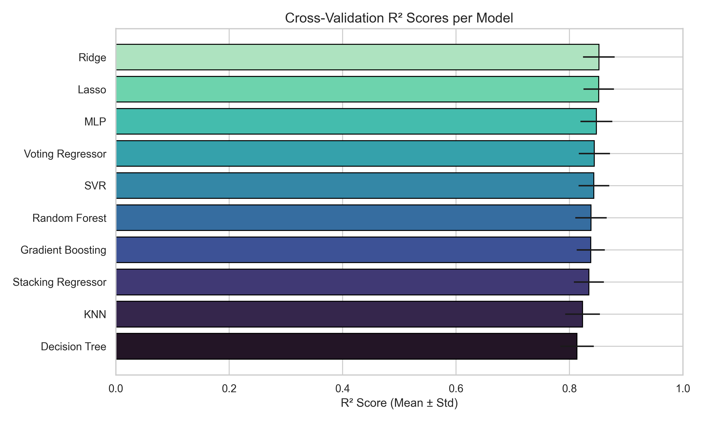
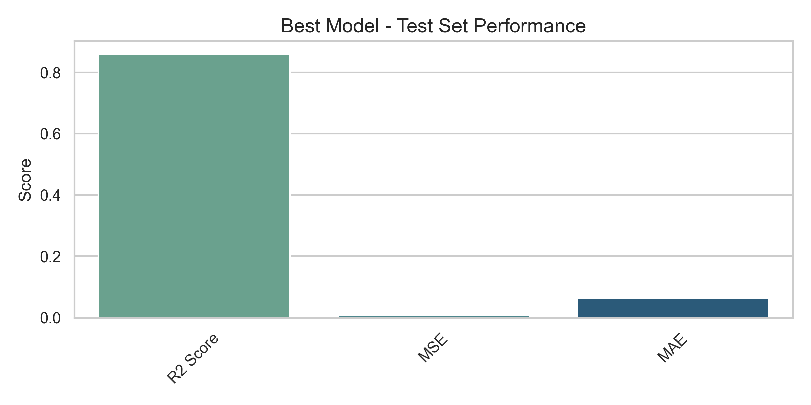
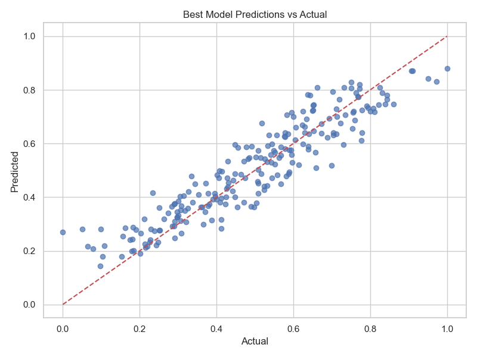
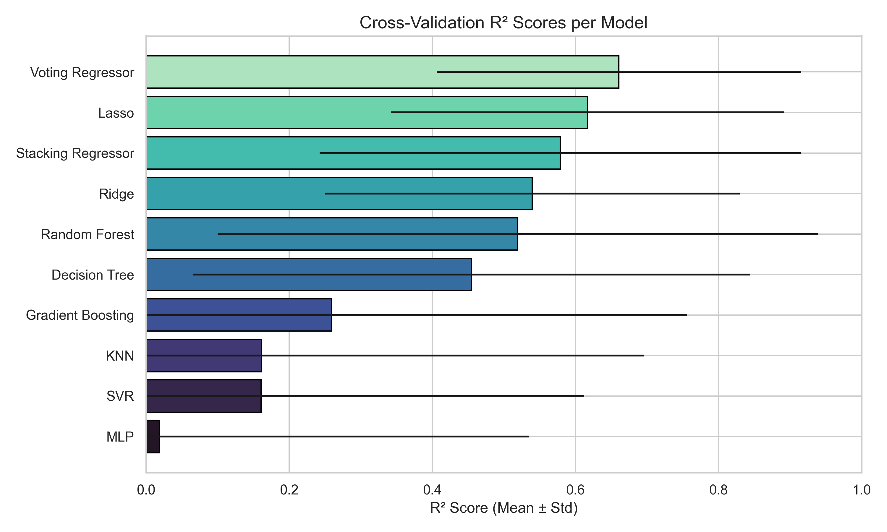
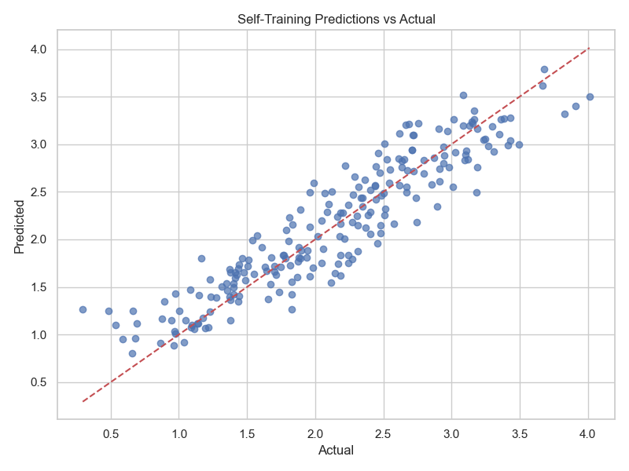
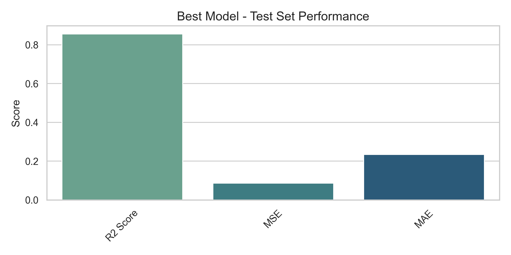
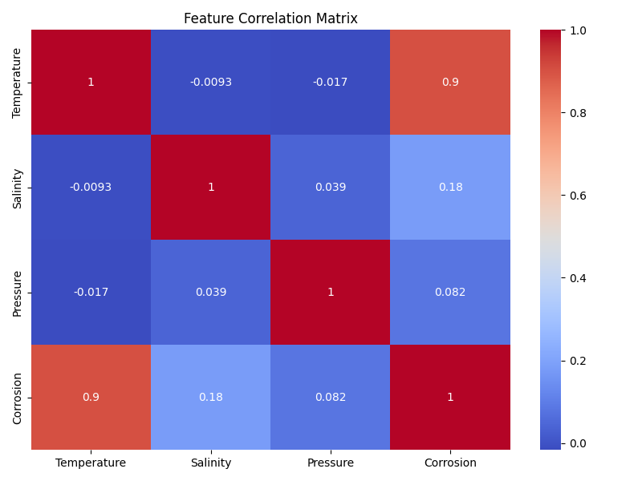

# 🧪 Corrosion Prediction in Underwater Cultural Heritage Environments

This repository contains machine learning pipelines for modeling and predicting corrosion in underwater cultural heritage (UCH) environments using both **supervised** and **semi-supervised (self-training)** regression techniques.

---

## 🗂 Repository Structure

```
.
├── main_self_training.py           # Semi-supervised learning pipeline
├── supervised_models.py            # Supervised learning pipeline
├── pipeline/
│   ├── data_loader.py              # Data preprocessing and partitioning
│   ├── evaluation.py               # Model evaluation and visualization
│   ├── models.py                   # Model definitions + self-training wrapper
├── figures/                        # Output plots (examples below)
├── results/                        # Cross-validation and test metrics
├── logs/                           # Execution logs
├── Dataset_Corrosion.csv          # Input dataset (not included)
└── README.md
```

---

## 📊 Problem Overview

We aim to model corrosion levels from environmental factors such as **Temperature**, **Salinity**, and **Pressure**. These approximations will help guide conservation strategies for UCH artifacts.

---

## 📁 Dataset Description

The dataset `Dataset_Corrosion.csv` was compiled by members of the BISITE research group (Carolina Villoria Torres and Juan Manuel Núñez Velasco). It contains:

- **Temperature**, **Salinity**, and **Pressure** readings collected from **SeaDataNet CDI** and **ODATIS-Coriolis** datasets.
- Data corresponds to the nearest available locations to the **TECTONIC pilot sites**.

Since no direct corrosion measurements exist, the **Corrosion** variable was inferred using **Kriging interpolation** (Cressie & Johannesson, 2008), based on data tables from **Wang et al. (2021)**.

### 📚 References:
- Wang, Z., Sobey, A. J., & Wang, Y. (2021). Corrosion prediction for bulk carrier via data fusion of survey and experimental measurements. *Materials & Design*, 208, 109910.
- Cressie, N., & Johannesson, G. (2008). Fixed rank kriging for very large spatial data sets. *Journal of the Royal Statistical Society: Series B*, 70(1), 209–226.

---

### 🔬 Target Distribution



---

## 🧠 Supervised Learning Pipeline

This script:
- Trains multiple regression models using 5-fold CV and grid search.
- Selects the best model based on R² score.
- Evaluates final performance on an unseen test set.

To run:
```bash
python supervised_models.py
```

### 📈 Cross-Validation Results



### ✅ Best Model Test Performance



### 🎯 Predictions vs Actual



---

## 🤖 Semi-Supervised Learning (Self-Training)

This pipeline uses only 10% of labeled data and gradually augments training data using confident predictions from the model itself. As new data becomes available, we can continue training with both labeled and unlabeled instances.

To run:
```bash
python main_self_training.py
```

### 🧪 CV Results Across Models



### 🎯 Predictions vs Actual



### ✅ Final Test Performance



---

## 🧬 Feature Correlations

Correlation matrix between input features and the corrosion target:



---

## 📋 Requirements

Install dependencies with:

```bash
pip install -r requirements.txt
```

### Main libraries:
- `scikit-learn`
- `pandas`, `numpy`
- `matplotlib`, `seaborn`
- `joblib`

---

## 📝 Notes

- Ensure the dataset `Dataset_Corrosion.csv` is available before running.
- Logs for each execution are saved in the `logs/` folder.
- Figures and metrics are automatically saved to `figures/` and `results/`.

---

## © License

MIT License. For research and educational use.


